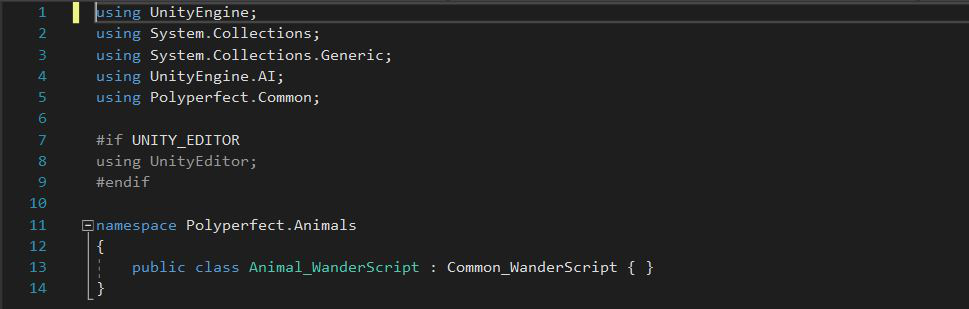

### Score weighting
| Description  | Weight |
| ------------- | ------------- |
| Gameplay video  | 5  |
| Code video  | 0  |
| Good code  | 20  |
| Bad code  | 20  |
| Development process  | 30  |
| Reflection  | 25  |

### Good Code
The wander scripts that are in the animals are the code I think is good, despite the fact that I didn't write much because I was more involved in the game's assets. 
The wander script, which I consider to be a really excellent and helpful script, handles all of the animal animations, including the moving, running, attacking, etc. 
Because they offer a straightforward and understandable method to replicate realistic movement and behavior, Unity's wander scripts are ideal for animating animal objects. 

The scripts can be modified to reflect the characteristics of the animal and employ a random walk technique to generate random movements and direction changes. 
Without having to manually keyframe each movement, this enables the creation of realistic animations.

### Bad Code
Since I didn't have much chance to code, there isn't a specific section that I would classify as "bad code." 
However, in general, I can state that a bad code may be defined by a lack of comments and minimal testing.
Which in this case, there is lack of comments and minimal testing as you can see it on the images.
It can be challenging to remark on things when there isn't a lot of code because they usually explain themselves.

### Reflection
I enjoyed the game programming course. I was impressed by the diversity of topics covered, from the basics of game design and development to advanced techniques 
for creating engaging and immersive experiences. 
I also appreciated the hands-on approach of the course, with plenty of opportunities to apply what I learned to project and through the project.

I mainly worked with the animals, but unfortunately I ran out of time before I could integrate them into the environment. I left the things last minute as it was the exam weeks and I wasn't able to implement them on the terrain before the deadline. As a result, they remained unused.

I had the opportunity to learn a wide range of concepts and techniques related to game design and development. 
I learned about the principles of game design and the different stages of the development process, from concept and planning to implementation and testing. 
I also learned about the technical aspects of game programming, such as data structures, algorithms, and software design patterns. 

One of the challenges I faced during the course was the overlap with some of my other courses at my home university. 
I was dealing with a heavy workload from my other courses, which made it difficult to find time to code. 
As an Erasmus student, I had the unique experience of taking classes in a different country and learning about different cultures and perspectives. 
This added to my workload, but I believe it also enriched my learning experience.

As an Erasmus student in Norway, I had the unique opportunity to take this game programming course and to learn from experienced instructors and 
talented classmates from different countries and cultures. This added to the richness and diversity of my learning experience, and exposed me to new perspectives and 
approaches to game design and development. This also came with some challenges, such as the need to adapt to a new environment and a different academic system. 
I feel like I could have performed better both personally and professionally. 
It was a different time in my life when I had a lot on my desk and finding time to catch up was challenging. 
However, I believe that these challenges have also helped me to grow and to develop new skills.

Despite the challenges, I tried my best to stay engaged and to make progress in the course. I sought help from my group members when I needed it. 
I am extremely grateful to Ole for his hard work and dedication on this project. I sometimes worked with him on different parts of the project other than my part where
he helped me to understand the different sections of our game.
He was a valuable asset to our group as our bear and always willing to lend a helping hand.
I was able to improve my developing skills and learn a lot about game programming. I particularly enjoyed working on the final project, 
where I had the chance to design and implement a game from scratch with my group. Overall, I found the game programming course to be both challenging and rewarding. 
I am grateful for the opportunity to take this course and to have had such a unique experience as an Erasmus student.
