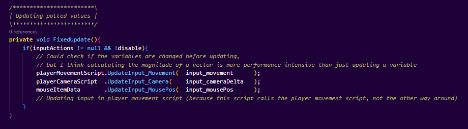
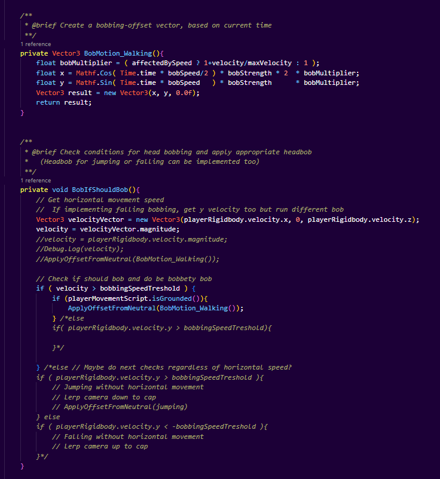
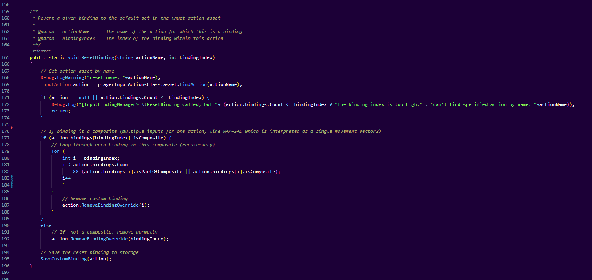
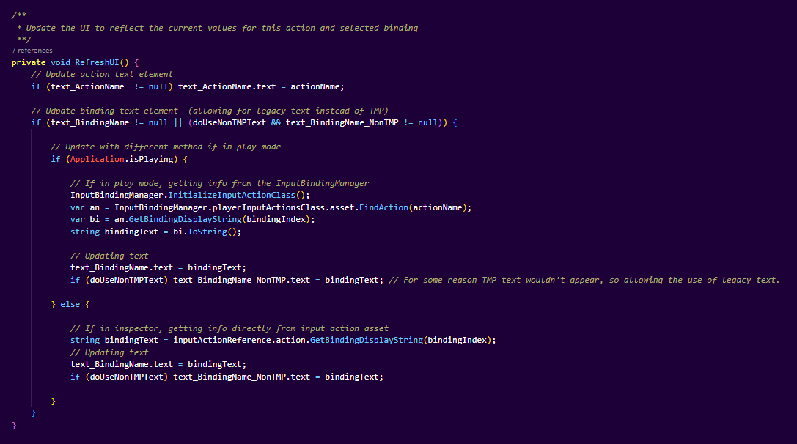

### Score weighing

| Description         | my weight |
| ------------------- | --------- |
| Gameplay video      | 5         |
| Code video          | 5         |
| Good Code           | 30        |
| Bad Code            | 25        |
| Development process | 25        |
| Reflection          | 10        |

# Individual Reflection - Julian Kragset

- A link to, and discussion of, code you consider good
- A link to, and discussion of, code you consider bad
- A personal reflection about the key concepts you learnt during the course
- Code involvement

--- 

#### **Parts I consider bad**

I don't like the way the [**Actions_OnFoot.cs**](https://github.com/oleelnes/Sandbox/blob/master/Assets/Code/Scripts/Input/Actions_OnFoot.cs)  class calls every script that needs to use input, instead of the other way around. If I had been able to implement Unity's new Input System earlier, I would rather have every script that needs inputs poll input from to the main input script, instead of the other way around. I would likely have opted for this hadn't the motherboard of my computer died while I hadn't yet pushed my code to the branch yet, but the delay meant that most input-using scripts were already implemented to some degree, so I decided that it would be less time consuming and give us a better overview to do it this way instead. One of the quirks of this is that, instead of the camera and movement scripts reading the inputs from a value, the Actions_OnFoot class instead polls these inputs locally and calls a method in the movement and camera scripts, both of which update a local variable in those classes. This feels quite inefficient and illogical, and at a small scale this is more of an annoyance than an actual issue. It's a subjective standard I chose due to the fact that I like to keep things centralized so it's easy to see everywhere input is used from one class.

Here's an example from the code, where I call every script that needs continuous input, and poll the input locally. The variables I pass as paremeters have getter functions that poll the Vector2 value form the appropriate action.  

[**BobController.cs **](https://github.com/oleelnes/Sandbox/blob/master/Assets/Code/Scripts/Player%26Camera/BobController.cs), which causes the camera to bob, was originally supposed to move the camera both vertically and horizontally relative to the camera orientation. The code used to apply this kind of a bobbing vector as an offset to the camera, but I couldn't figure out how to rotate this 2D vector relative to the orientation of the camera. Due to lack of time I simply ended up disabling the horizontal bobbing effect, after spending some hours on trying to make it relative to the camera orientation, making a lot of the code written for this functionality not necessary in the end, as it was better to spend that time on rebinding when it doesn't make a big visual difference. One of the reasons this is a shame is because I think the rest of the code in BobController is pretty good and modular, easily allowing for different kinds of bobbing offsets by having each type of bobbing be their own method, allowing for things like different ones when jumping or falling, which I wrote some pseudocode for.

Here's an example from the bobbing code, showing its modularity and the pseudo-code that could easily be implemented if the plane was aligned  with the orientation vector.

I came upon an issue with a plugin I used for higher resolution text elements called TextMesh Pro, where no matter what I tried with Z position and layers, text wouldn't display over a specific button. To fix this I simply allowed the usage of regular Text elements alongside TextMesh Pro text elements for this specific button, but due to the chained nature of the methods in the rebinding classes that means that some methods have an extra parameter just to allow the usage of regular Text elements. I left the old TextMesh Pro as a parameter as well in case I managed to fix the TextMesh Pro problem, but in the meantime it makes the code a bit less clear.

---- 

#### Parts I consider good

**[/Assets/Code/Scripts/Input/InputBindingManager.cs](https://github.com/oleelnes/Sandbox/blob/09d868f1ff608a2f2884bfd24bb1bf619a52923c/Assets/Code/Scripts/Input/InputBindingManager.cs)**
This class handles the rebinding of inputs using Unity's new Input System, it uses the bare-bones built-in method of rebinding and adds to it the ability to easily rebind composite inputs (such as WASD -> movement vector) by recursively looping over every part of the composite. It also handles persistent bindings, by saving a string of the binding being rebound and saving it to player preference storage, and then performing these rebindings automatically whenever the class is initialized. The bindings become universal through a static instance of the input action class which is generated from the input action asset, which Actions_OnFoot uses. When the game is loaded, all stored custom bindings are applied to this global class. The method DoRebind is my favorite, it uses built-in events and recurses if the binding is a composite, it also calls custom events that are caught by other parts of the code, like when the rebinding is complete, as that is asynchronous. 

Here's an example from the code

**[/Assets/Code/Scripts/Input/Rebinder.cs](https://github.com/oleelnes/Sandbox/blob/e990f6d46d768f453c72d74ef113589393013e14/Assets/Code/Scripts/Input/Rebinder.cs)**
This class neatly uses the InputBindingManager class and built-in functions in Unity's new Input System to make the process of creating a button that lets the player rebind something, really easy for the developer. To make a new action rebindable, all a developer has to do is drag in a new rebinding prefab, select the action in the inspector, and then select the binding index (e.g. controller or keybard) which will be rebound. This class also binds itself to events called by the Input System's core rebinding functionality, to update UI elements when the player e.g. cancels rebinding, which I think was a good solution.

Here's an example from the code.

I'm quite happy with the quality of my code in general in this project, and how my code integrates with the other code in the project despite. I put a lot of time into the documentation and structure of my code as well, to make it readable and easily understandable despite complexity.

--- 

#### **Personal reflection about the key concepts i learnt during the course**

I learnt about the importance of frequent communication in online projects, to make sure there are no misunderstandings. I also learnt about the importance of regularly pushing your work, not just regularly committing it, in case of suddenly losing access to files, which I learnt the hard way when my motherboard died overnight and I lost progress, causing a delay. I learnt about using events in Unity, how to utilize static properties and make classes work together by putting thought into code architecture, and I learnt a lot about good project organization in general. I also got more comfortable with sprint cycles and Unity in general, and how to pace the development of games.

### Notable code involvement

Link to the folder with input-related code: [Sandbox/Assets/Code/Scripts/Input  · GitHub](https://github.com/oleelnes/Sandbox/tree/master/Assets/Code/Scripts/Input)

( "\\" => /Assets/Code/Scripts )

| File(s)                                                                                                                                                                                                                                                                                                                                                                                                                                               | Claim   | Description                                                                                                                                                                                                                                                                                                                                                                                 |
| ----------------------------------------------------------------------------------------------------------------------------------------------------------------------------------------------------------------------------------------------------------------------------------------------------------------------------------------------------------------------------------------------------------------------------------------------------- |:-------:| ------------------------------------------------------------------------------------------------------------------------------------------------------------------------------------------------------------------------------------------------------------------------------------------------------------------------------------------------------------------------------------------- |
| \Input/Actions_OnFoot.cs                                                                                                                                                                                                                                                                                                                                                                                                                              | All     | The script that manages inputs that control the player, the "OnFoot" action map. Binds action events, such as when buttons are pressed and released or when an axis is changed, to methods in different scripts.                                                                                                                                                                            |
| \\Audio/PlayCrouchSound.cs \| \\Audio/PlayJumpSound.cs \| \\Player&Camera/PlayerCam.cs \| \\Player&Camera/PlayerMovement.cs \| \\Weapons/MeleeAttack.cs \| \\Menus/PauseMenu.cs \| \\inventory/UI Scripts/InventoryUIController.cs \| \\inventory/Inventory Scripts/PlayerInventoryHolder.cs \| \Weapons/WeaponSwitching.cs \| \inventory/Interactor.cs \| \inventory/Inventory Scripts/MouseItemData.cs \| \inventory/UI Scripts/InventoryDisplay.cs | Touched | Converted from old to new unity input system, by - instead of reading directly from input - updating their values from the central Actions_OnFoot.cs class, which handles the OnFoot action map.                                                                                                                                                                                            |
| \\Menus/SetScene.cs                                                                                                                                                                                                                                                                                                                                                                                                                                   | All     | Small script with methods to change scenes by index or string, to be attached to buttons that need to change scenes.                                                                                                                                                                                                                                                                        |
| Assets/Level/Scenes/BindingMenu.unity                                                                                                                                                                                                                                                                                                                                                                                                                 | All     | A menu that lets you rebind all common inputs.                                                                                                                                                                                                                                                                                                                                              |
| Assets/Level/Scenes/MainMenu.unity                                                                                                                                                                                                                                                                                                                                                                                                                    | Half    |                                                                                                                                                                                                                                                                                                                                                                                             |
| \\Player&Camera/BobController.cs                                                                                                                                                                                                                                                                                                                                                                                                                      | All     | Attached to the camera, simulates a head-bobbing effect.                                                                                                                                                                                                                                                                                                                                    |
| Assets/Level/Scenes/TerrainScene.unity Assets/Level/Scenes/CaveScenePillars.unity                                                                                                                                                                                                                                                                                                                                                                     | Touched | Integrated camera bobbing & new Input System                                                                                                                                                                                                                                                                                                                                                |
| \\Input/PlayerInputActions.inputactions                                                                                                                                                                                                                                                                                                                                                                                                               | All     | The Input Action Asset containing action maps with actions (e.g. "jump"), along with default bindings. This allows both controllers and keyboards to be supported at the same time, and if a players controller isn't registered by Unity as a compatible gamepad (e.g. a joystick) they can bind it themselves in the rebinding menu.                                                      |
| Assets/Prefabs/inputScripts.prefab                                                                                                                                                                                                                                                                                                                                                                                                                    | All     | Prefab containing everything needed for inputs to work, including an event system configured for the new Input System (meant to be the only ones in the scene), and needed input scripts.                                                                                                                                                                                                   |
| Assets/Prefabs/Player Objects.prefab                                                                                                                                                                                                                                                                                                                                                                                                                  | All     | Prefab containing every object needed to produce a player in a scene. Including event system and input scripts.                                                                                                                                                                                                                                                                             |
| Assets/Prefabs/Rebind Prefab.prefab                                                                                                                                                                                                                                                                                                                                                                                                                   | All     | A UI component letting the player persistently rebind a single binding for an action, configurable by the developer in the inspector by selecting the desired action and then the binding.                                                                                                                                                                                                  |
| \\Input/Rebinder.cs                                                                                                                                                                                                                                                                                                                                                                                                                                   | All     | The script that lets "Rebind Prefab.prefab" uses to do its rebinding and to update its visuals to instruct the player. Calls InputBindingManager to do the actual rebinding and binding memory management. Written to make the rebinding process as easy as possible for the player, and to make it as easy as possible for the developer to create new rebinding buttons.                  |
| \\Input/InputBindingManager.cs                                                                                                                                                                                                                                                                                                                                                                                                                        | All     | The script that handles rebinding, and the persistency of rebinding. It manages persistency by saving details of the new binding into a string in player preference memory, when the player starts the rebinding process. Then loading the saved binding string from memory, parsing it and applying it to the Input Action class, whenever the static instance of the it class is created. |
