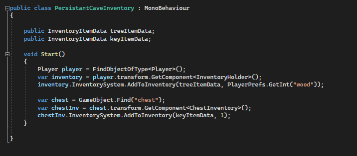

### Score weighting
|Description | min | def | max |
|----|----|---|----|
|Gameplay video | 0 | 0 | 0 |
|Code video | 5 | 10 | | 15 |
|Good Code | 15 | 20 | 25 |
|Bad Code | 10 | 15 | 20 |
|Development process | 20 | 25 | 30 |
|Reflection | 25 | 30 | 35 |

### Bad Code 
I consider the following code for bad: 

At the very end of our development process, we discovered that the inventory system is not persistent throughout  the scenes. A quick fix for this problem was using PlayerPrefs method. 
Although this method works, I would prefer to use a more persistent storage, like JSON. A better solution would be implementing possibility of saving current game state to JSON and updating/loading the inventory part of JSON file on scene change. 
Adding the key item to chest in cave is also a more temporary solution and loading contents from JSON file would be much better. 

### Good code 
The following code I consider good: 

In this code section we have three functions: AddToInventory, ContainsItem and HasFreeSlot. I consider this code good because this is one of the functions I have spent the most amount of time developing and I am happy with the results.

### Reflection
This project is my first meeting with game design and development, working with Unity and using C#. For the better part of the last 6 months I have been part of group with 5 other people i didn't knew before.
This journey has been fun and challenging most of the time, but it could sometimes be brutal with numerous errors and countless merge conflicts. 

When it came to dividing the project within the group, I wanted to work with the backend aspect of the game, as I am pretty terrible at the frontend part. I started by implementing some simple logic for running and jumping in the early stage of the game. 
Then I took on the challenge of creating an inventory system. Initially I thought this would be so much easier then it turned out to be. My first thought was to implement an UI for backpack and display items there. 
I created a database in the backend and was able to successfully add and remove items in the backpack. This solution worked well, but was also extremely limited: My goal was to implement a functioning action bar for the player, 
where the player could choose different weapons, use items (ex: eat apple) etc. The problem was that the action bar and the backpack were two different systems that didn't cooperate. This is when I scrapped the project and started on inventory v2.0.

Inventory v2.0 was a much successful attempt. I created an inventory system with three sub-systems (backpack, action bar, chest) that all derive from the same "templates" (ex: ChestInventory and PlayerInventoryHolder both derive from InventoryHolder).
In this iteration, all three sub-systems are working together. This is an iteration I am happy with, Although my initial goal of a working action bar never came to fruition.
As I initially thought that this inventory system wouldn't take that much time and be only one of features I would implement to this game, this turned out to be a much bigger challenge and most of my time used on this project was either research of or implementation of the inventory system. 

As mentioned before, I have been working in a group of 6 on this project. In my opinion the work and cooperation within the group was very good. As mentioned in the group discussion, we held regular meeting. 
This was also challenging as we had different schedules and not everyone could meet on campus. Overall I would consider the group work good and successful. 

This has been a challenging and sometimes frustrating experience. I learned alot about the game development in general, how to use Unity and write scripts in C#. As mentioned before, my initial thought was to create the inventory system as one of contributions to the game. 
I wanted to make a bigger impact, but I learned quickly that implementing bigger features, especially if that feature need to live in symbiosis with other elements in its enviroment, isn't easy and takes time. 
My vision of the game before we began was different from our en product, but I am still happy with both my contribution and the overall group effort.
After this course I definitly have much deeper understanding of the game development process and bigger respect for developers. 

