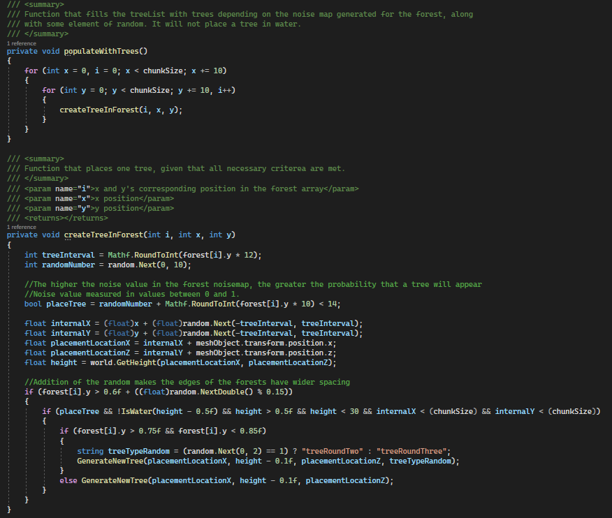

# Ole 

## Rubric

### Score weighting
| Description         | my weight |
|---------------------|-----------|
| Gameplay video      | 10        |
| Code video          | 10        |
| Good Code           | 15        |
| Bad Code            | 15        |
| Development process | 25        |
| Reflection          | 25        |


## Bad code
In the figure below, is an example of code I have written that I consider bad. It is nearly impossible
for other people than me to understand what I am doing in this code. It is a way too long function 
without any outsourcing which lacks reasonable variable names, and cohesion as to what it is I am trying 
to do. The function itself is called "HeightScaleAndColor", suggesting that this function is responsible 
for two things: height scale, and color. But it also sets the water level for the noise map it takes in.
As I am hesitant to have an unnecessary amount of loops, I think it is fine that the function does 
several things, but the way that everything is meddled together is what is bad. The function also
takes in parameters that strictly speaking are not needed anymore, and it sets the globalWaterLevel
everytime it finds a perlin noise value that is under the threshold for it to be water. 

Now, the reason that this function is so bad, is because it was initially not meant to be the permanent 
solution to the texturing of the ground. We wanted to implement a shader for the coloring of the 
ground, but it was time and again not prioritized. Another big reason why it is bad is because it was
worked on and modified a lot, and a lot of times only to check if something worked or not, and then when
it did work, the code remained without being improved upon. 


The code snippet below shows how I'd remedy this function. I would change the name to something more 
understandable, make it short, as well as clear what it is that it does. I would get rid of the 
outdated variables and functionalities. Most importantly, I would outsource the setting of the ground
color to another function. This way, the function looks more balanced between its two main priorities:
setting the scale and setting the ground color; instead of having one of them take up 95% of the space.

```
private Color[] ScaleAndColorHandler(Vector3[] noiseMap, Vector2 position, float waterLevel) {
    Color[] colorMap = new Color[noiseMap.Length];
    for (int i = 0; i < noiseMap.Length; i++) {
        colorMap[i] = SetGroundColor(i, noiseMap, position, waterLevel); 
        noiseMap[i].y *= heightScale;
    }
}
```


## Good code
The function in the figure below manages the destruction of objects in the game, such as cutting down a tree.
It is an example of a function where everything that can be outsourced to other functions, has been.
Moreover, the names of the functions and checks it calls make sense, and it is simple to understand
what happens on every line, and in every function that it calls. This makes the function very readable
for other humans, which is one of the most important things in programming. In long functions it can
be unclear what the different parts of the code does. Optimally, I would like all my functions to follow
this style with the approach of outsourcing.<br><br>

<br><br>

In the figure below is an example of code that I am proud of, but which does not necessarily have the
greatest variable names or the best possible outsourcing. The if-checks' conditions are exhaustive,
as an example. However, this code is somewhat clever, because these two functions are responsible for 
creating the forests. 

The forest array is an array filled with noise map values. The value of the 
noise decides whether or not a tree should be placed in the location that the value represents. 
Above a certain threshold (0.6), trees might be placed, and the probability of a tree being planted
increases as the noise value increases. TODO: more
<br><br>



## Reflection
Being able to make this game has been valuable experience for me. As the bear of the group, I have felt 
a great attachment to the project. The game was based on a long-lived dream I have had to create a game 
set in a procedurally generated world. And getting to co-create it with so many talented and invested
group members was a joy. As we mentioned in the group discussion, our main priority shifted over time 
to be the technical aspects of the game, as we realized the scope of making both an intriguing story and 
gameplay in addition to an impressive procedural world, was simply too much. Coming to this conclusion 
felt like a defeat — knowing that it, for the most part, would not be fun to play our game.

I have learned a lot as a result of this project, and it has felt like one of the first real tests 
of our skills in team- and project development in practice. Of the things that I have learned about 
is Unity in general, C#, version control, procedural generation, and to code with others. Learning about 
Unity has been both a blessing and a curse. It is a powerful tool for making games, but it has some
downsides, such as merge difficulties. In terms of version control, I have learned a lot about using 
it more professionally, such as with delegating each feature to its own branch, and subsequently, to
create pull requests and merge them without wrecking havoc on the master branch. The last main thing 
I have learned a lot about is procedural generation.

In our project, I volunteered to be the person behind the procedural generation. I knew there were tons
of tutorials out there with complete solutions for procedural generation, but initially, I wanted to 
the majority of it myself, without help. However, this proved to be far too time-consuming for a school
project, and I had to start follow tutorials to a greater extent. Procedural generation was also the backbone
of the project and everything else built on top of it; if I was slow with implementing this, 
the others would be greatly reduce others' ability to implement what they were working on, and potentially 
cause irritation. In hindsight, it could have been a better approach to
put two people on procedural generation, and accomplish it through discussions and pair programming.

About teamwork here.

I am very pleased with how the look of the game turned out. Designing the algorithm and logic behind
the forests and the rest of the procedural object placement was perhaps the greatest challenge, but also
the most fulfilling when it all finally came together, and this time without following any tutorials. 

Lastly, this project has given me a newfound respect for game development. There are many moving pieces 
in a game. In the beginning, it felt like walking on eggshells when writing new code or adding new features/
gameobjects — you never knew what odd error would show up. With time, this gave me a greater understanding 
of how everything in the project was tied together, as well as making me more careful.

