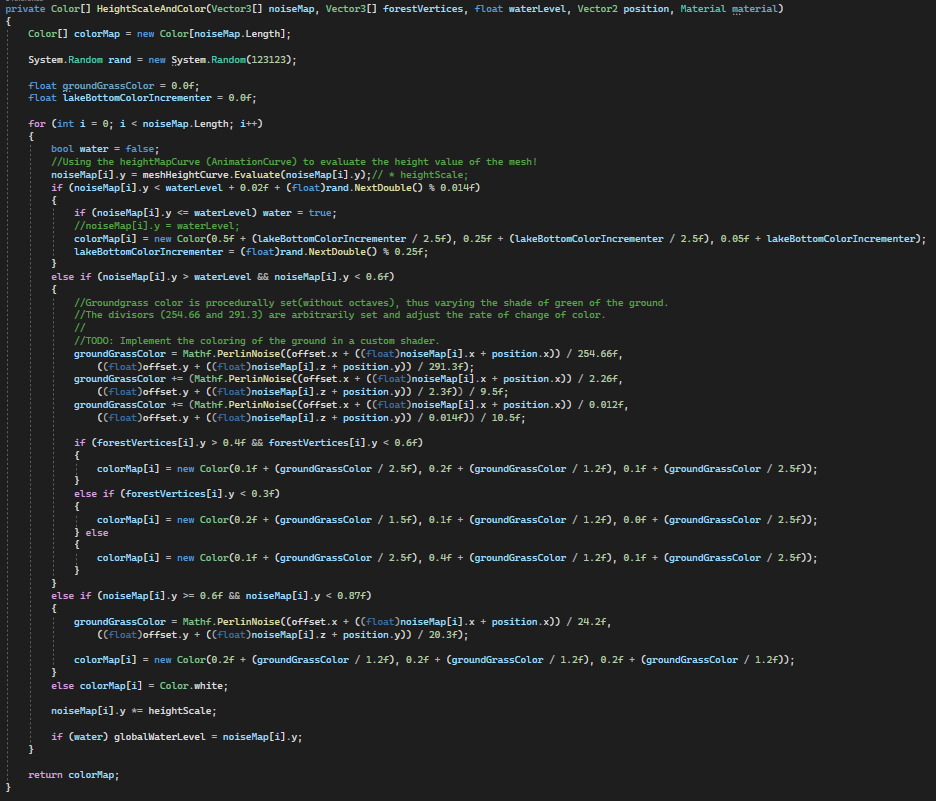
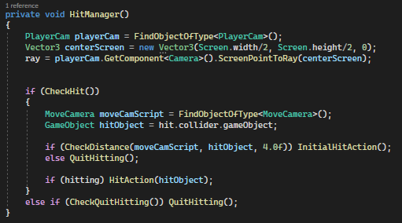

# Ole 

## Rubric

### Score weighting
| Description         | my weight |
|---------------------|-----------|
| Gameplay video      | 10        |
| Code video          | 10        |
| Good Code           | 15        |
| Bad Code            | 15        |
| Development process | 25        |
| Reflection          | 25        |

## Bad code

## Good code

## Reflection
Being able to make this game has been valuable experience for me. As the bear of the group, I have felt 
a great attachment to the project. The game was based on a long-lived dream I have had to create a game 
set in a procedurally generated world. And getting to co-create it with so many talented and invested
group members was a joy. As we mentioned in the group discussion, our main priority shifted over time 
to be the technical aspects of the game, as we realized the scope of making both an intriguing story and 
gameplay in addition to an impressive procedural world, was simply too much. Coming to this conclusion 
felt like a defeat — knowing that it, for the most part, would not be fun to play our game.

I have learned a lot as a result of this project, and it has felt like one of the first real tests 
of our skills in team- and project development in practice. Of the things that I have learned about 
is Unity in general, C#, version control, procedural generation, and to code with others. Learning about 
Unity has been both a blessing and a curse. It is a powerful tool for making games, but it has some
downsides, such as merge difficulties. In terms of version control, I have learned a lot about using 
it more professionally, such as with delegating each feature to its own branch, and subsequently, to
create pull requests and merge them without wrecking havoc on the master branch. The last main thing 
I have learned a lot about is procedural generation.

In our project, I volunteered to be the person behind the procedural generation. I knew there were tons
of tutorials out there with complete solutions for procedural generation, but initially, I wanted to 
the majority of it myself, without help. However, this proved to be far too time-consuming for a school
project, and I had to start follow tutorials to a greater extent. Procedural generation was also the backbone
of the project and everything else built on top of it; if I was slow with implementing this, 
the others would be greatly reduce others' ability to implement what they were working on, and potentially 
cause irritation. In hindsight, it could have been a better approach to
put two people on procedural generation, and accomplish it through discussions and pair programming.

I am very pleased with how the look of the game turned out. Designing the algorithm and logic behind
the forests and the rest of the procedural object placement was perhaps the greatest challenge, but also
the most fulfilling when it all finally came together, and this time without following any tutorials. 

Lastly, this project has given me a newfound respect for game development. There are many moving pieces 
in a game. In the beginning, it felt like walking on eggshells when writing new code or adding new features/
gameobjects — you never knew what odd error would show up. With time, this gave me a greater understanding 
of how everything in the project was tied together, as well as making me more careful.

