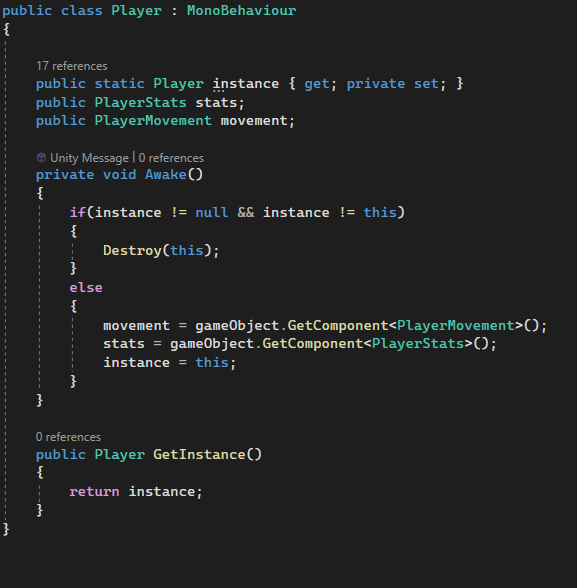
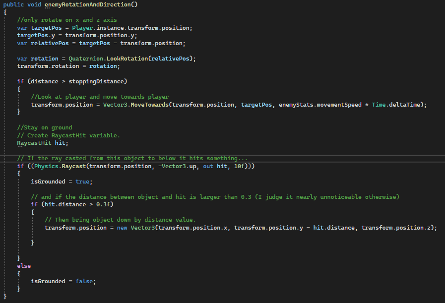
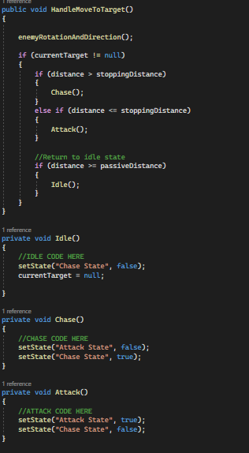

# Viktor

## Rubric
### Score weighting
| Description         | my weight |
|---------------------|-----------|
| Gameplay video      | 5         |
| Code video          | 10        |
| Good Code           | 20        |
| Bad Code            | 25        |
| Development process | 25        |
| Reflection          | 15        |
### Good code
There are a few contributions that I consider good code. For one the Singleton in the Player script. Working with a Singleton is not always considered good, but in our case, we only have one player, which makes it useful to ensure only one instance of the Player class is initialized. 
  

I also implemented everything surrounding the enemies in the game. For the enemies, I tried to make a facade pattern work to have one script holding all the related enemy objects like animation, movement, stats, etc. As we are using procedural generation baking a map for the navMesh was not a possibility. That is why I used another way to move the enemy around and target the player. I used quaternation to rotate the enemy towards the player, a raycast to recognize hitting an obstacle (in our case the ground), and lastly a stopping distance to make sure the enemy only moves toward the player until it has reached a certain distance. 

 
To receive/give damage from/to the enemy I used colliders. Whenever such a collision is triggered the enemy/player stats are updated. For the enemy to receive damage I send a message to the enemy manager to run the ‘receiveDamage’ function. This makes sure the current health in the EnemyStats script is updated, which also updates the health bar. For the player, I check if the distance between the player and the enemy is smaller than the assigned attack distance. If so, the enemy will call the ‘takeDamage’ method from the player instance given a certain amount of damage.
### Bad Code
The code that I consider bad is that of the enemy states. At first, I tried to implement a state pattern but eventually made way for a more convenient way of changing the states of the enemy (idle, scream, chase, attack, death). Because I was learning to work with the animations for the first time, I hardcoded the changes of state for the animations and used events on the animations themselves to call the functions with the necessary functionality related to the state at that time. Working in this way left me with divided code, making it difficult to navigate. For the animation states, I used an animator component. I also used this state machine for other animations: tools, melee, and the enemy boss.  

 
### Reflection
I have learned a lot about game development and remote teamwork in this course. 
For this project, we chose to use Unity as our game engine. This decision was made by the group. Unity made it easier for rookie game developers to translate our knowledge into practice. Unreal Engine was not an option as it would have been difficult to get a positive and complete outcome and get as far as we have gotten.

Throughout this course, I have had to learn to go through forums, read documentation, work in a team with starting game developers and get a taste of the development process of a game project. I have had experience with design patterns in a previous java course, so it was fun to use this previously required knowledge for game development. This course has shown me that game development is a lot harder than I initially thought. My first impression was that game development would be mostly logic-based, making it easy to implement all the features we expected to implement. For the enemies, I imagined that it would’ve been easy to find fitting assets on the asset store later to find out that nothing was quite suiting for what I initially had in mind. This made me dive deep into making models and animations from scratch. At the beginning of making these assets I started to use blender, but later found out that there are some compatibility issues between unity and blender. It took a long time to get my first fully functional enemy working. After making one enemy, I reused the same character and modified the model as I saw fit to make multiple.  
In the beginning, I had a large scope in mind. I expected, a team of six people, to have a complete game by the end of the semester. I am astonished by the amount of knowledge needed in a variety of areas to make a fully-fledged game. I made my animations and models for the enemies (except for the boss which comes from the synty store). 

In this project, I stood in as scrum master using Trello for our scrum board. I solely developed the enemies, boss battle, sounds, animations, weapons, and tools from start to finish. I also contributed to the player scripts. 

Our team has worked great together, with some making more of an effort than others. In the end, everyone had their part in our sandbox game. 
Overall, I would say that our team has successfully created a sandbox game learning a lot in the process. Both the course and the project were fun to engage in and very informative. After this project, I find myself more comfortable with designing a game. Writing the codebase was the most difficult part of this journey. Knowing this, in the future, I will dive deeper into the best practices of writing code for a game.

 
